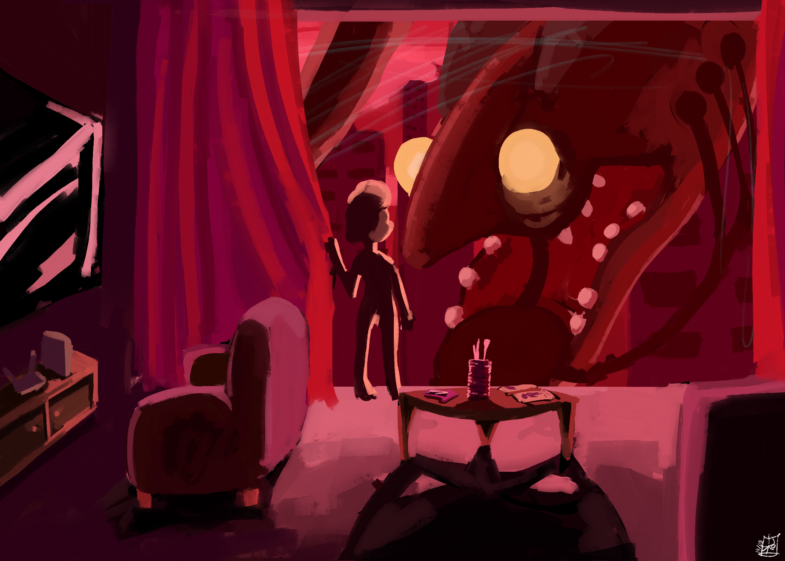

  <h1>Trabalho 1: Camiseta</h1>

- bsbsbsbsbs

  <h1>Trabalho 2: Paleta</h1>

  <h1>
Trabalho 3: Cores e Cultura</h1>

  <h1>
Trabalho 4: Sinestesia</h1>

# Welcome to MkDocs

For full documentation visit [mkdocs.org](https://www.mkdocs.org).

* `fuck fuc cu fff
* * `m`- Create a new project.
      mkdocs.yml    # The configuration file.
    docs/
