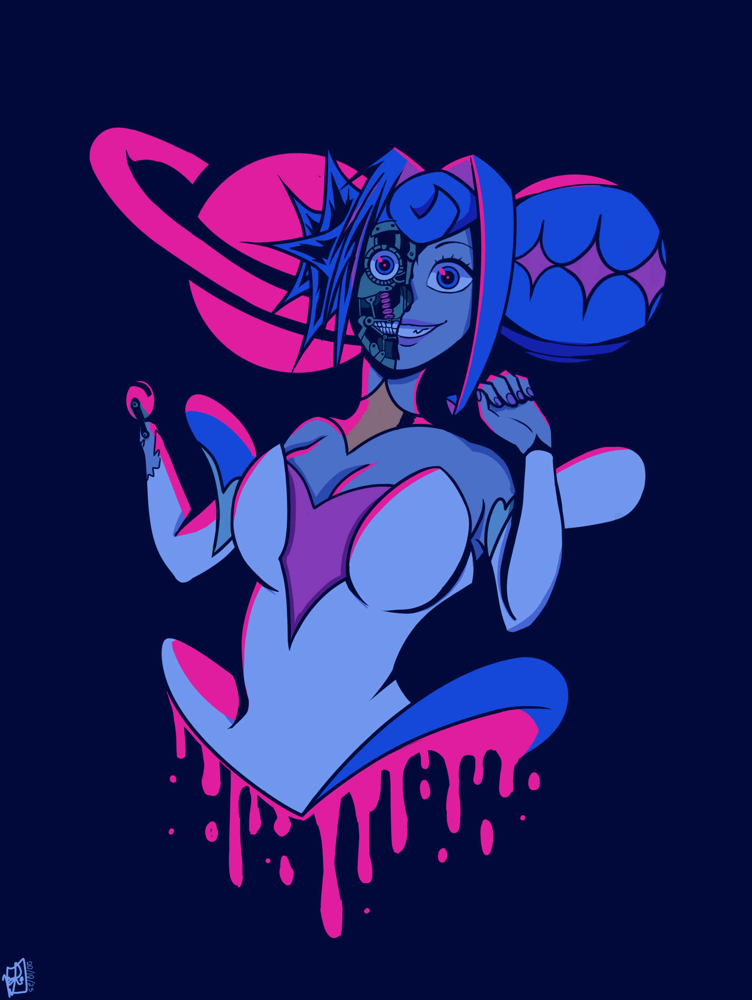

  <h1>Trabalho 1: Camiseta</h1>

Design da imagem da camiseta

### A imagem faz uso predominante das cores azul e roxo desaturadas que harmonizam com o rosa claro e bem saturado. O desing também leva em consideração a cor da camisa, que tem a mesma cor que a linhas do desenho e as sombras mais intensas. 

  <h1>Trabalho 2: Paleta de floresta</h1>

A paleta desenvolvida segue abaixo:

### Ela foi criada pensando em uma floresta anoite, demosntrado pelos tons de azul. O rosa vem da ideia de flora flourencente.

  <h1>
Trabalho 3: Cores e Cultura</h1>

### Nessa parte do trabalho foi escolhido a cor vermelha, e para a escolha dos subtemas, foram selecionados perigo (da cultura ocidental) e poder(da cultura vodu)

## PERIGO

### Essa imagem usou o senso de conforto e segurança da moradia e adicionou uma criatura desconhecida que quebra o senso de segurança, causando a sensação de desconforto e medo que o perigo gera.

## PODER

### Para poder foi usado a deusa Hécate, ultilizando seu design do jogo Hades II. Ela é conhecida como das encruzilhadas, luz, magia, etc, e era adornadas em lares como um símbolo de proteção, vindo disso a minh associação de poder com ela. 

  <h1>
Trabalho 4: Sinestesia</h1>

## "Seu olhar frio e silencioso"

### Para a sinestesia ser mais efetiva na imagem, foi ultilizado primariamente cores "frias" e desaturadas para reforcar a sensação do frio, enquanto o "silencioso" foi usado de forma mais literal, mas também é acompanhado do espaço vazio ao redor do indivíduo e a falta de expressão para criar a sensação de silêncio.

